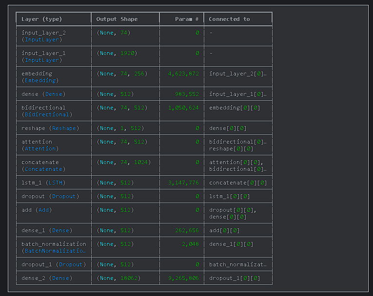
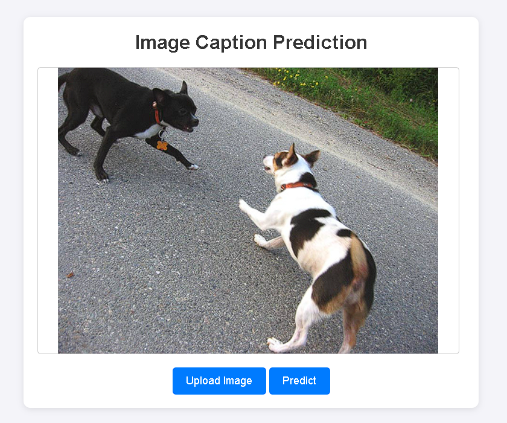
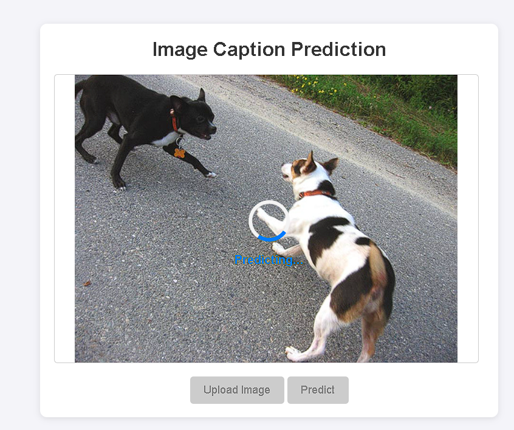
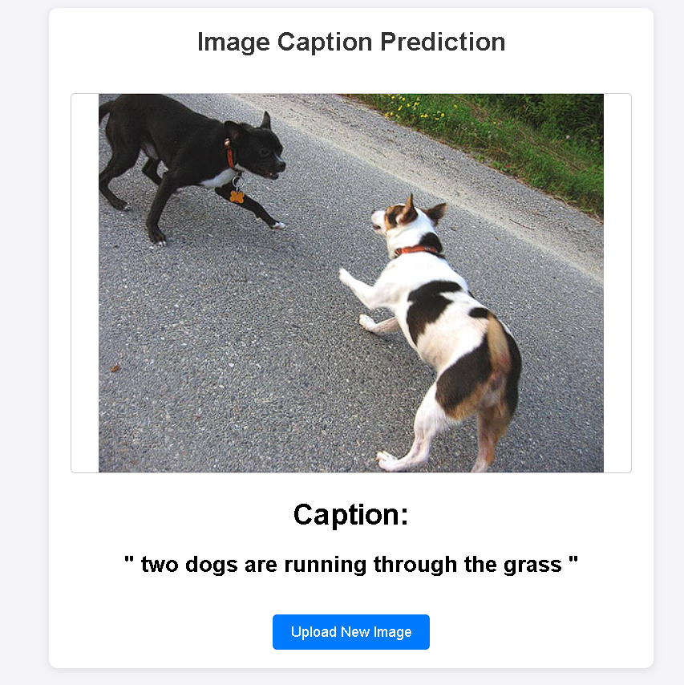

# IMAGE CAPTION MODEL
LSTM and CNN based Image Caption Prediction System (Trained on Flickr30K)

# Image Caption Prediction System

This repository hosts a Django-based web application for generating captions for uploaded images. The project includes a deep learning model for image captioning, built using TensorFlow and Keras, and provides a responsive user interface for easy interaction.

## Features
- **Django Framework**: A robust backend for handling image uploads, predictions, and result display.
- **Custom Image Captioning Model**:
  - Processes image features and tokenized captions.
  - Employs **DenseNet** for pre-extracted image features.
  - Includes an **Attention Mechanism** for aligning image features with text.
  - Uses **Bidirectional LSTM** for understanding caption sequences.
  - Incorporates **Dropout** and **Batch Normalization** to improve model generalization.
- **Large File Management**: Google Drive for model files (`.h5`).
- **Frontend Enhancements**:
  - Upload preview and prediction loading spinner.
  - Buttons disabled during predictions for better UX.

## Model Architecture

- Input:
  - Pre-extracted image features (1920-D vector from DenseNet201 Model).
  - Tokenized captions (max length: `74`).
- Architecture Highlights:
  - Dense layers for image feature processing.
  - Attention mechanism for context alignment.
  - Bidirectional and stacked LSTMs for sequence processing.
  - Fully connected layers for word predictions.
- Output:
  - Vocabulary size (`18062`) softmax for word predictions.

## Technologies Used
- **Backend**: Django
- **Deep Learning**: TensorFlow, Keras
- **Frontend**: HTML, CSS, JavaScript

## Requirements
- Python 3.10
- Django 5.1
- TensorFlow 2.16.1
- Git LFS for model file storage


# INSTALLATION

### Step 1: Clone the Repository

Use the following commands to clone the repository and navigate into the project directory:

```bash
git clone https://github.com/Kartik-A-1820/image_caption.git
cd image_caption
```

### Step 2: Create a Virtual Environment and Install Dependencies

```bash
conda create -n image_caption_env python=3.10
conda activate image_caption_env
pip install -r requirements.txt
```

### Step 3: Download Models

##### Download and replace the models folder: https://drive.google.com/drive/folders/1-yWfX6GavDFjzfemayKq24ug5dM1J-N3?usp=sharing


### Step 4: Configure the Database
```bash
python manage.py makemigrations
python manage.py migrate
```

### Step 5: Start the Development Server
```bash
python manage.py runserver
```

#### Access the application in your browser at http://127.0.0.1:8000.


# Screen Shot



